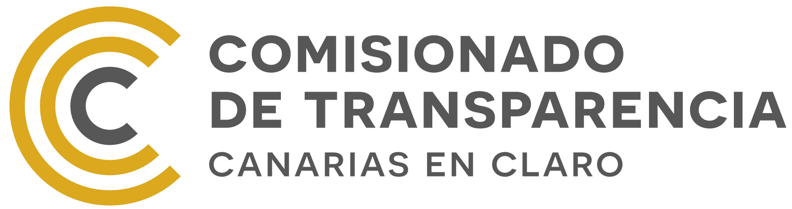

import { Image } from 'astro:assets';
import { Aside } from '@astrojs/starlight/components';
import { CardGrid } from '@astrojs/starlight/components';
import { Icon } from '@astrojs/starlight/components';
import { documentsInfo } from '../../data/documents.ts';
import ImageCard from '../../components/ImageCard.astro';
import institucionalImage from '../../assets/images/sections/institucional.svg';
import adminImage from '../../assets/images/sections/administradores-directivos.svg';
import organizativaImage from '../../assets/images/sections/organizativa.svg';
import economicaImage from '../../assets/images/sections/economica-financiera.svg';
import contratosImage from '../../assets/images/sections/contratos-y-convenios.svg';
import ayudasImage from '../../assets/images/sections/ayudas-subvenciones.svg';
import logoImage from '../../assets/logo-light.svg';
import '../../styles/landing.css';

  

  ## Transparencia y Buen Gobierno
  

  <Image src={logoImage} alt="Logotipo de Infinity Transparencia" />

---

  <ImageCard
    title="Información Institucional"
    description="Identidad y certificaciones."
    href="/informacion-institucional/quienes-somos/"
    imageSrc={institucionalImage}
    imageAlt="Icono de información institucional"
  />
  <ImageCard
    title="Administradores y Directivos"
    description="Roles y perfiles del equipo directivo."
    href="/informacion-sobre-administradores-y-directivos/administradores-y-cargos-directivos"
    imageSrc={adminImage}
    imageAlt="Icono de administradores y directivos"
  />
  <ImageCard
    title="Subvenciones y Ayudas"
    description="Datos de ayudas y subvenciones."
    href="/informacion-de-ayudas-y-subvenciones/ayudas-y-subvenciones"
    imageSrc={ayudasImage}
    imageAlt="Icono de subvenciones y ayudas"
  />
  <ImageCard
    title="Inf. Económica y Financiera"
    description="Balances y memorias económicas."
    href="/informacion-economica-y-financiera/resultados-economicos"
    imageSrc={economicaImage}
    imageAlt="Icono de información económica y financiera"
  />
  <ImageCard
    title="Información Organizativa"
    description="Estructura y organización interna."
    href="/informacion-organizativa/organigrama-y-estatutos/"
    imageSrc={organizativaImage}
    imageAlt="Icono de información organizativa"
  />
  <ImageCard
    title="Contratos y convenios"
    description="Datos de contratos y convenios públicos."
    href="/informacion-de-contratos-y-convenios/informacion-de-contratos"
    imageSrc={contratosImage}
    imageAlt="Icono de contratos y convenios"
  />

---

<code class="last-update">Última actualización {documentsInfo.last_update}</code>

## Principios Rectores

Nuestra política se basa en el cumplimiento de la <a href="https://www.boe.es/eli/es/l/2013/12/09/19/con" target="_blank" alt="Acceso externo a Ley 19/2013, de 9 de diciembre, de transparencia, acceso a la información pública y buen gobierno">Ley 19/2013, de 9 de diciembre, de transparencia, acceso a la información pública y buen gobierno</a> y en los principios de la <a href="https://www.boe.es/eli/es-cn/l/2014/12/26/12" target="_blank" alt="Acceso externo a Ley Canaria 12/2014, de 26 de diciembre, de transparencia y acceso a la información pública">Ley Canaria 12/2014, de 26 de diciembre, de transparencia y acceso a la información pública</a>. 

Estos principios incluyen:

- **Publicidad activa**: la información debe ser accesible a todos sin necesidad de solicitud previa.
- **Accesibilidad**: la información debe ser fácil de entender y usar.
- **Claridad**: la información debe ser precisa, completa y actualizada.
- **Objetividad**: la información debe ser neutral e imparcial.

<Aside type="tip" title="Compromiso Open Source">
  Utilizamos formatos abiertos para los archivos con datos que exponemos siempre que es posible. También publicamos el código fuente de nuestro portal de transparencia en GitHub.
</Aside>

## Evaluación Externa

Para garantizar la transparencia y la rendición de cuentas, nos sometemos periódicamente a la evaluación externa del <code><a href="https://transparenciacanarias.org/" target="_blank" alt="Acceso a la web del Comisionado de Transparencia de Canarias">Comisionado de Transparencia de Canarias.</a></code> En este proceso, se revisa nuestro cumplimiento de la Ley de Transparencia y se realizan recomendaciones para mejorar nuestras prácticas.

La transparencia es esencial para fortalecer la confianza de nuestros socios, colaboradores y de la sociedad en general; por ello, nos comprometemos a:
- Someternos a controles y auditorías externas que verifiquen el cumplimiento de nuestros estándares.
- Publicar toda la información relativa a nuestras memorias anuales, balance de cuentas, actividades, y cualquier otra información relevante de manera abierta y reutilizable.
- Facilitar el acceso a la información a través de nuestro portal web y otros canales de comunicación.
